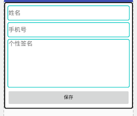
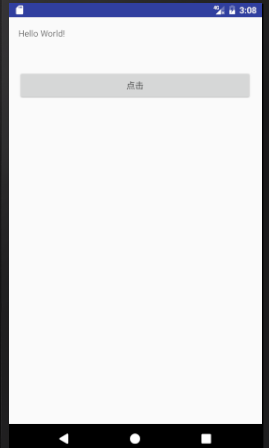
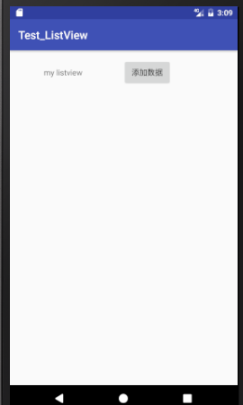
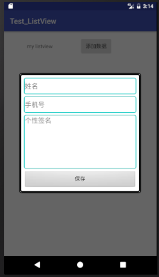
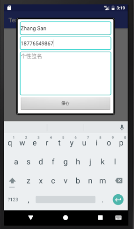
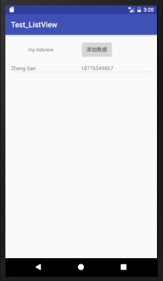

# 项目的准备
## 数据库
* 构建数据库及表
```
public class DBHelper extends SQLiteOpenHelper {

    //数据库 名字 自己取
    private static final String DATABASE_NAME = "xx.db";
    private static final int DATABASE_VERSION = 1;

    //构造方法
    public DBHelper(Context context, String name, SQLiteDatabase.CursorFactory factory,
                    int version) {
        super(context, name, factory, version);
    }

    public DBHelper(Context context) {
        this(context, DATABASE_NAME, null, DATABASE_VERSION);
    }

    @Override
    public void onCreate(SQLiteDatabase db) {
        // 创建person表
        String personTable = "create table if not exists Person" +
                "(id INTEGER PRIMARY KEY AUTOINCREMENT ," +
                "sname VARCHAR(255), " +
                "sid VARCHAR(255) )";
        db.execSQL(personTable);
    }

    // 如果DATABASE_VERSION值被改为2,系统发现现有数据库版本不同,即会调用onUpgrade
    @Override
    public void onUpgrade(SQLiteDatabase db, int oldVersion, int newVersion) {
        db.execSQL("ALTER TABLE Person ADD COLUMN other STRING");
    }

}
```

* 定义一个Person类
```
public class Person {
    public int id;
    public String sname;
    public String sid;

    public Person()
    {
    }

    public Person(String name, String sid)
    {
        this.sname = name;
        this.sid = sid;
    }
}
```

* 数据库中表的增删改查
```
public class DBManager {

    private DBHelper helper;
    private  SQLiteDatabase db;

    public DBManager(Context context) {
        helper = new DBHelper(context); // 因为getWritableDatabase内部调用了mContext.openOrCreateDatabase(mName, 0,mFactory);
        // 所以要确保context已初始化,我们可以把实例化DBManager的步骤放在Activity的onCreate里
        db = helper.getWritableDatabase();
        db = helper.getReadableDatabase();
    }

    public boolean user_insertUser(Person per) { //增添数据项
        boolean b = false;
        db.beginTransaction();
        try {
            Cursor c = db.rawQuery(
                    "select * from Person where sname=?" , new String[] { per.sname });
            if (c == null || c.getCount() <= 0) {
                db.execSQL("insert into Person values(null,?,?)", new Object[] {
                        per.sname,
                        per.sid }
                );
                b = true;
            }
            c.close();
            db.setTransactionSuccessful(); // 这个事务成功的也必须加上
        }catch (SQLException e) {
            db.endTransaction();
            b = false ;
        }finally{
            db.endTransaction(); // 最后事务一定要结束
        }
        return b;
    }

    public List<Person> user_getAll() { //得到所有的数据项
        List<Person> models = new ArrayList<Person>();
        Person p = null ;
        Cursor c = db.rawQuery("select * from Person" , null) ;
        while (c.moveToNext()) {
            p = new Person();
            p.id = c.getInt(c.getColumnIndex("id"));
            p.sname = c.getString(c.getColumnIndex("sname"));
            p.sid = c.getString(c.getColumnIndex("sid"));
            models.add(p);
        }
        c.close() ;
        return models ;
    }

    public boolean user_deleteBySid(String sid) { //删除某个数据项
        boolean b = false;
        try {
            db.execSQL("delete from Person where sid=?",
                    new String[] { sid });
            b = true;
        }catch (SQLException e) {
            b = false ;
        }
        return b;
    }

    public Person user_getBySid(String sid) { //由id得到相应的Person并返回（查）
        Person p = null ;
        Cursor c = db.rawQuery("select * from Person where sid=?" , new String[] { sid }) ;
        while (c.moveToNext()) {
            p = new Person();
            p.id = c.getInt(c.getColumnIndex("id"));
            p.sname = c.getString(c.getColumnIndex("sname"));
            p.sid = c.getString(c.getColumnIndex("sid"));
        }
        c.close() ;
        return p ;
    }

    public Person user_getBySname(String sname) { //由name得到相应的Person并返回（查）
        Person p = null ;
        Cursor c = db.rawQuery("select * from Person where sname=?" , new String[] { sname }) ;
        while (c.moveToNext()) {
            p = new Person();
            p.id = c.getInt(c.getColumnIndex("id"));
            p.sname = c.getString(c.getColumnIndex("sname"));
            p.sid = c.getString(c.getColumnIndex("sid"));
        }
        c.close() ;
        return p ;
    }

}
```

如何使用数据库：

1、定义和初始化DBmanager
```

DBManager dbMag; //定义

//在activity的onCreate方法中初始化(初始化是会创建数据库和数据库表)

dbMag = new DBManager(getApplicationContext());
```
2、操作数据库表

增：
```
 Person per = new Person("123","456");
 dbMag.user_insertUser(per);
```
查：
```
 List<Person> lp = dbMag.user_getAll();
```
删：
```
 Person per = new Person("123","456");
 dbMag.user_deleteBySid(per.sid);
```

## 弹框的设置
* 定义弹框xml界面
```
<LinearLayout xmlns:android="http://schemas.android.com/apk/res/android"
    android:id="@+id/create_user_dialog_view"
    android:layout_width="match_parent"
    android:layout_height="wrap_content"
    android:paddingTop="30dp"
    android:paddingBottom="30dp"
    android:minWidth="200dp"
    android:background="@drawable/dialog_load_bg"  //自定义背景
    android:orientation="vertical"
    android:padding="10dp">

    <EditText
        android:id="@+id/text_name"
        android:layout_width="fill_parent"
        android:layout_height="wrap_content"
        android:background="@drawable/edit_bg"
        android:hint="姓名"
        android:minHeight="45dp"
        android:textSize="18sp" />

    <EditText
        android:id="@+id/text_mobile"
        android:layout_width="fill_parent"
        android:layout_height="wrap_content"
        android:layout_marginTop="5dp"
        android:background="@drawable/edit_bg"
        android:hint="手机号"
        android:minHeight="45dp"
        android:textSize="18sp" />

    <EditText
        android:id="@+id/text_info"
        android:layout_width="fill_parent"
        android:layout_height="wrap_content"
        android:layout_marginTop="5dp"
        android:background="@drawable/edit_bg"
        android:gravity="top|left"
        android:hint="个性签名"
        android:minHeight="145dp"
        android:textSize="18sp" />

    <Button
        android:id="@+id/btn_save"
        android:layout_width="fill_parent"
        android:layout_height="wrap_content"
        android:layout_marginTop="5dp"
        android:text="保存" />

</LinearLayout>
```

显示图片如下：



* Java代码
```
public class CreateUserDialog extends Dialog {

    /**
     * 上下文对象 *
     */
    Activity context;
    private Button btn_save;
    public EditText text_name;
    public EditText text_mobile;
    public EditText text_info;

    private View.OnClickListener mClickListener;

    public CreateUserDialog(Activity context) {
        super(context);
        this.context = context;
    }

    public CreateUserDialog(Activity context, int theme, View.OnClickListener clickListener) {
        super(context, theme);
        this.context = context;
        this.mClickListener = clickListener;
    }

    @Override
    protected void onCreate(Bundle savedInstanceState) {
        super.onCreate(savedInstanceState);
        // 指定布局
        this.setContentView(R.layout.create_user_dialog);

        text_name = (EditText) findViewById(R.id.text_name);
        text_mobile = (EditText) findViewById(R.id.text_mobile);
        text_info = (EditText) findViewById(R.id.text_info);

        /*
         * 获取圣诞框的窗口对象及参数对象以修改对话框的布局设置, 可以直接调用getWindow(),表示获得这个Activity的Window
         * 对象,这样这可以以同样的方式改变这个Activity的属性.
         */
        Window dialogWindow = this.getWindow();

        WindowManager m = context.getWindowManager();
        Display d = m.getDefaultDisplay(); // 获取屏幕宽、高用
        WindowManager.LayoutParams p = dialogWindow.getAttributes(); // 获取对话框当前的参数值
        // p.height = (int) (d.getHeight() * 0.6); // 高度设置为屏幕的0.6
        p.width = (int) (d.getWidth() * 0.8); // 宽度设置为屏幕的0.8
        dialogWindow.setAttributes(p);

        // 根据id在布局中找到控件对象
        btn_save = (Button) findViewById(R.id.btn_save);

        // 为按钮绑定点击事件监听器
        btn_save.setOnClickListener(mClickListener);

        this.setCancelable(true);
    }
}

```

# 项目的具体实现
## 主界面

设置一个按钮实现点击跳转到ListView界面



## ListView界面



界面初始没有数据，点击“添加数据”按钮出现弹框，如图所示：



可以添加数据，点击保存后，ListView界面就能看到添加的数据项，并且重新打开软件也能看到，如图所示：





## Java代码
 具体见codes

